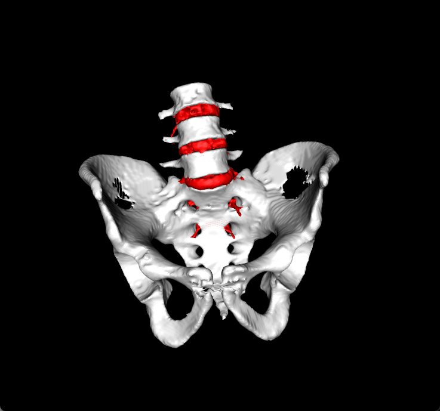
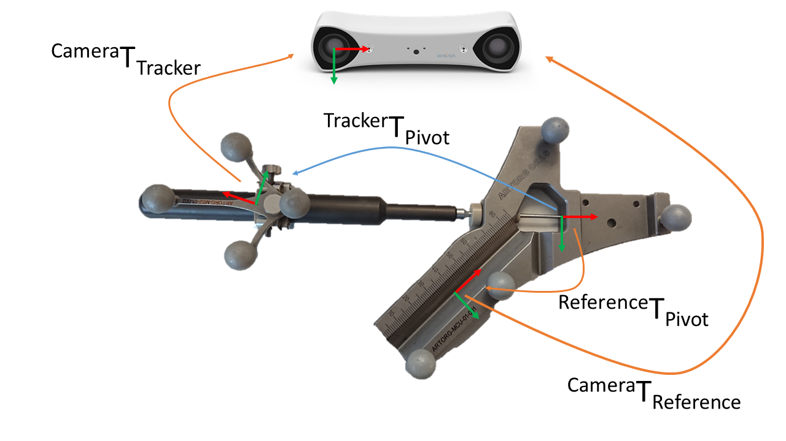
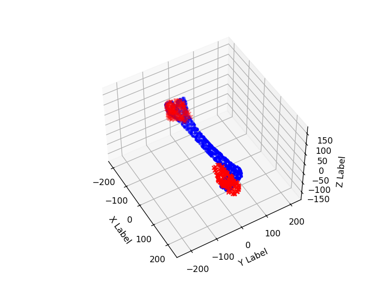
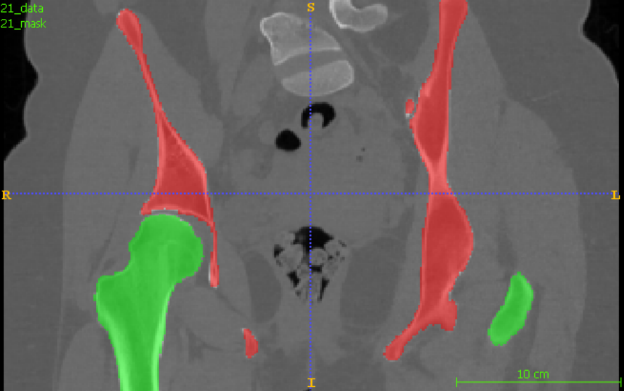

Computer Assisted Surgery Pipeline
============================================

1. **Surgical planning** by applying the segmentation algorithm **Region-Growing**.
We are segmenting the spinal disks, by going though the CT volume and putting a seed on each vertebrae. 

2. **Tool calibration** by defining the matrices from reference-to-pivot, camera-to-reference, tracker-to-pivot, camera-to-tracker.

3. **Registration** using *Iterative Closest Point* to align the cloud point for a bone CT scan in blue. 

4. **Artificial Intelligence** for CT hip segmentation. We use DICE and Hausdorff score to evaluate the performance. 
We use a **U-NET** segmentation for *10 epochs*, with different *learning rates*.

The performance for the hyper-parameter fine-tuning are put in the following table. 
| CT        | Hip Learning Rate | Epoch | Dice    | HD      | ASD    |
|-----------|-------------------|-------|---------|---------|--------|
| Acetabulum| 0.1               | 5     | 94.96%  | 114.97  | 50.38% |
| Femur     | 0.1               | 5     | 95.59%  | 212.26  | 50.09% |
|-----------|-------------------|-------|---------|---------|--------|
| Acetabulum| 0.1               | 10    | 92.41%  | 117.66  | 66.67% |
| Femur     | 0.1               | 10    | 95.40%  | 110.00  | 66.49% |
|-----------|-------------------|-------|---------|---------|--------|
| Acetabulum| 0.001             | 5     | 95.70%  | 49.98   | 45.98% |
| Femur     | 0.001             | 5     | 96.91%  | 129.16  | 44.34% |
|-----------|-------------------|-------|---------|---------|--------|
| Acetabulum| 0.001             | 10    | 95.99%  | 55.00   | 45.01% |
| Femur     | 0.001             | 10    | 97.26%  | 110.39  | 40.39% |
|-----------|-------------------|-------|---------|---------|--------|
| Acetabulum| 0.00001           | 5     | 93.92%  | 74.92   | 63.94% |
| Femur     | 0.00001           | 5     | 94.82%  | 111.21  | 68.91% |
|-----------|-------------------|-------|---------|---------|--------|
| Acetabulum| 0.00001           | 10    | 94.46%  | 57.11   | 59.17% |
| Femur     | 0.00001           | 10    | 95.83%  | 158.23  | 55.78% |

